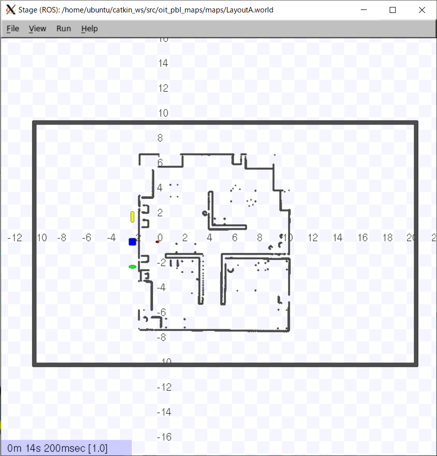
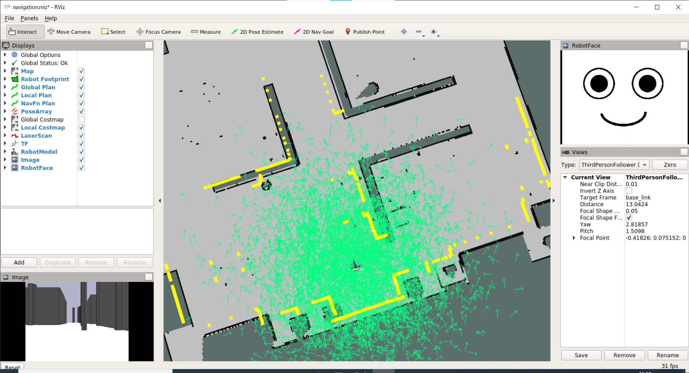
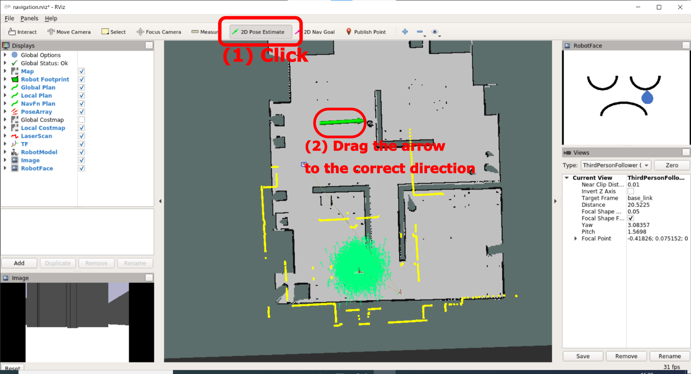
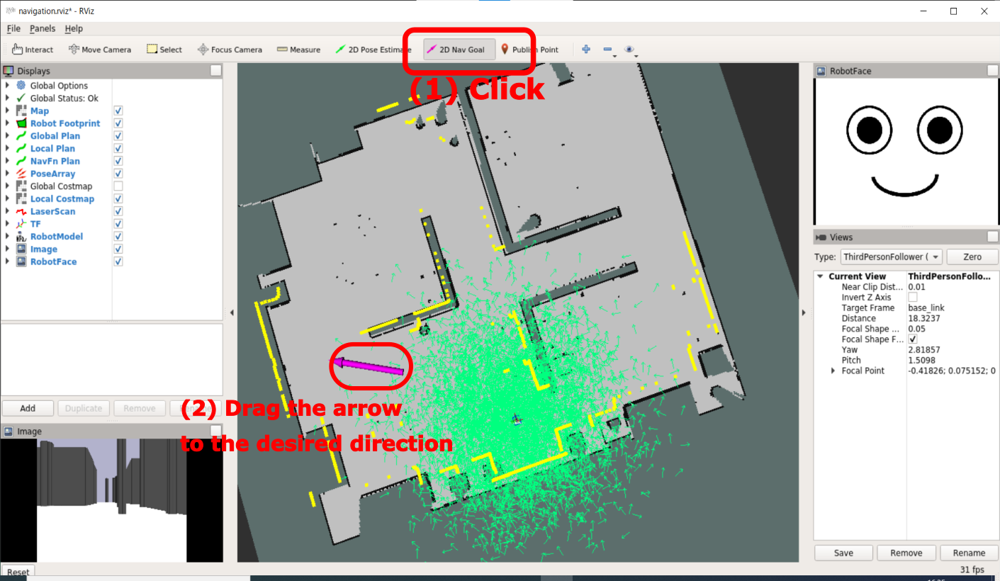
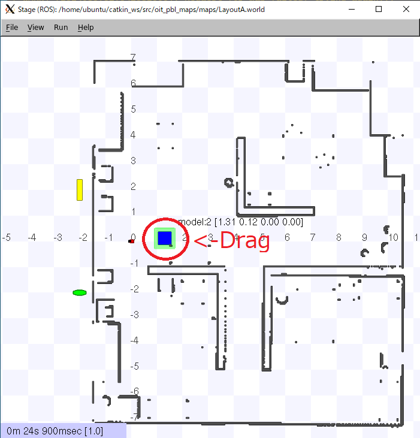
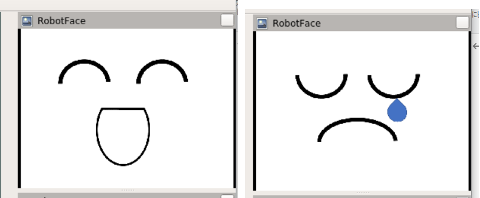

# 準備

[README](../README.md)

---

## Robot group 演習用基本ソフトインストール

```shell
$ cd catkin_ws/src/
$ git clone https://github.com/KMiyawaki/oit_pbl_ros_samples.git
$ git clone https://github.com/KMiyawaki/oit_stage_ros.git
$ git clone https://github.com/KMiyawaki/oit_pbl_maps.git
$ cd ~/catkin_ws && catkin_make
```

## シミュレータの動作確認

```shell
$ roslaunch oit_stage_ros navigation.launch
```

### 画面の説明

- `Stage`が生成したシミュレーションの世界。[`Stage`](https://github.com/rtv/Stage)は比較的軽量なロボットシミュレータである。



- `RViz`（**重要**）
  - `ROS`のシステムで頻繁に使用する可視化ソフト。
  - 今回のサンプルではあらかじめ取得されている地図上にロボットが置かれている様子が表示されている。



## ロボットのナビゲーション

ロボット用語としてのナビゲーションは、任意の位置にロボットを自律移動させることを指す。次の 2 つのステップから成る。

1. 自己位置推定
2. 障害物回避しながら目標位置への移動

これらの機能は ROS では Navigation メタパッケージによって実現できる。

- 実機でもシミュレーションでも使える。
- 参考 [ROS の navigation のページ](http://wiki.ros.org/navigation)

### 自己位置推定

あらかじめ取得された地図の形と、ロボット搭載の LRF から得られたデータを比較することでロボットが現在地図上のどこにいるかを推定する。  

- `Stage`上でロボット（赤いブロック）をドラッグしてから実施すること。

`RViz`上で`2D Pose Estimate`ボタンをクリックし、地図上のロボットがいるであろう場所から向いている方向に向かって左ドラッグして離す。



LRF のデータ（黄色い線で示されている）が地図の壁とおおよそ一致すれば OK 。

#### **注意**

いくつかのシミュレーションではもともとロボットの自己位置推定が完了した状態で始まるものもあり、その場合は推定は不要である。

### ナビゲーションゴールの指定

`RViz`上で`2D Nav Goal`ボタンをクリックし、ゴール地点でロボットを向かせたい方向に向けて左ドラッグして離す。



### Stage 内でのロボットや障害物の移動

ロボットや色のついたブロックはドラッグすると移動できる。



## ロボットの表情変更

1. ナビゲーションを起動する。
    - ``~catkin_ws/src/oit_stage_ros/scripts/face_image_publisher.py`が同時に実行されて、RViz上に表情が表示される。
2. さらに別ターミナルで`rostopic pub /robot_face_type std_msgs/String "data: 'happy'" -1`と実行すると表情の画像が変わる。
    - `'happy'`を`'sad'`や`'normal'`に変えて実行することもできる。



## 参考文献

- [How to Use Player/Stage](http://player-stage-manual.readthedocs.io/en/stable/)

---

[README](../README.md)
