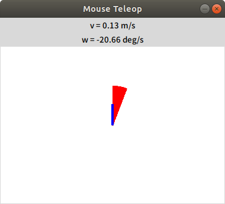

# Robot control (1)

[README](../README.md)

---

## シミュレータを起動する

```shell
$ roslaunch oit_stage_ros navigation.launch
```

別ターミナルで`rostopic list`コマンドを実行してみる。現時点で重要なトピックは以下の通り。

```shell
$ rostopic list
...
/base_scan # Virtual laser range finder's data
...
/cmd_vel # Velocity command to robot
...
/image   # Picture grabbed by virtual camera 
...
/odom    # Robot's position with some errors
...
/robot_face_image # Robot's facial image
...
```

## コマンドでロボットを動かす

下記コマンドを入力するが、`Tab`キーを活用しコマンド補間をしながら入力すること。  
コマンドを実行するとロボットが0.4m/secで前進し、いつかは壁にぶつかって停止する。

```shell
$ rostopic pub /cmd_vel geometry_msgs/Twist "linear:
 x: 0.4
 y: 0.0
 z: 0.0
angular:
 x: 0.0
 y: 0.0
 z: 0.0"  -r 10
```

`Ctrl+C`でコマンドの実行を停止する。  
次に下記のコマンドで回転をさせる。回転速度の単位はラジアン/秒である。

```shell
$ rostopic pub /cmd_vel geometry_msgs/Twist "linear:
 x: 0.0
 y: 0.0
 z: 0.0
angular:
 x: 0.0
 y: 0.0
 z: 0.52"  -r 10
```

`Ctrl+C`でコマンドの実行を停止する。

## キーボードでロボットを動かす

シミュレータを`Ctrl+C`で終了して再度起動する。別ターミナルで下記コマンドを入力し、入力したウィンドウでキーを使ってロボットを移動させる。

- `i`：前進、`j`：左旋回、`l`：右旋回、`,`：後退。

```shell
$ rosrun teleop_twist_keyboard teleop_twist_keyboard.py
```

`Ctrl+C`でコマンドの実行を停止する。

## マウスでロボットを動かす

- 次のコマンドで Mouse Teleop というタイトルのウィンドウが開く。

```shell
$ rosrun  mouse_teleop mouse_teleop.py mouse_vel:=cmd_vel
```

- Mouse Teleop ウィンドウ上でマウスをドラッグすると前進・旋回速度をロボットに与えられる。



- Mouse Teleop はウィンドウの「☓」マークをクリックしないと終了できないので、注意。

---

[README](../README.md)
