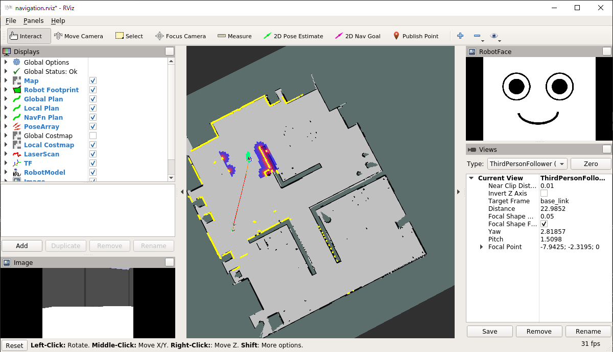
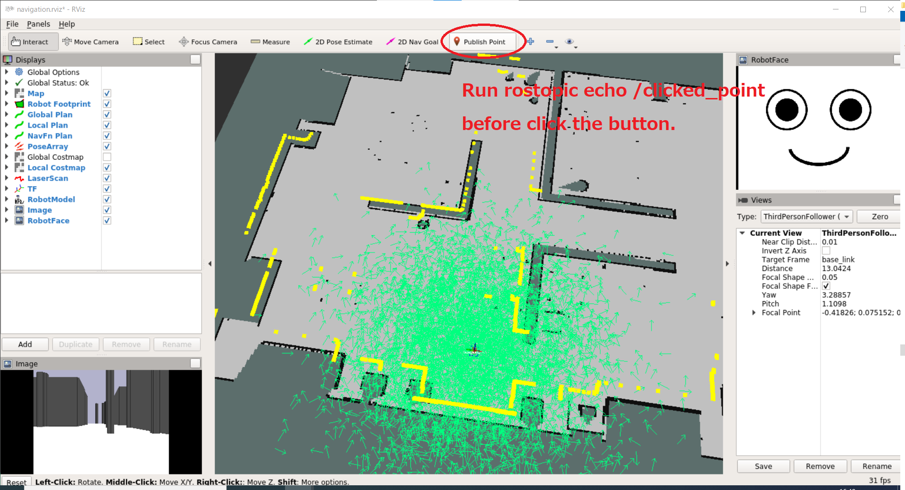

# Robot control (3)

[README](../README.md)

---

## ROS のナビゲーションを使う

[`ROS navigation`メタパッケージ](http://wiki.ros.org/navigation)を使い指定した座標まで自律移動させる。  
現状でも`/cmd_vel`に速度をパブリッシュすればロボットを動かせる。しかし`ROS navigation`を使えば、大域的・局所的な経路計画と障害物回避機能を簡単に使うことができる。  
`ROS navigation`の機能は`move_base`というノードによって提供されている。ユーザのプログラムは下記手順によって`move_base`の機能を呼び出す。

1. `move_base`に接続する。
2. `move_base`に接続が完了するのを待機する。
3. `move_base`に目的地を送信し、完了を待機する。

### 演習

`oit_pbl_ros_samples`パッケージにプログラムを作成する。

```shell
$ roscd oit_pbl_ros_samples/scripts
$ pwd
/home/[user name]/catkin_ws/src/oit_pbl_ros_samples/scripts
$ touch navigation.py
$ chmod u+x navigation.py
$ cd ..
$ code .
```

下記プログラムを入力する。コピー＆ペーストでも構わない。

```python
#!/usr/bin/env python
# -*- coding: utf-8 -*-

import math
import os
import actionlib
import rospy
from move_base_msgs.msg import MoveBaseAction
from utils import navigation


class Navigation(object):
    def __init__(self):
        self.move_base_name = "move_base"

    def process(self):
        # connect to move_base action server
        ac = actionlib.SimpleActionClient(self.move_base_name, MoveBaseAction)
        # wait until connnect to move_base action server
        while not ac.wait_for_server(rospy.Duration(5)):
            rospy.loginfo("Waiting for the move_base action server to come up")
        rospy.loginfo("The server comes up")
        # send navigation goal x, y, theta
        navigation(ac, 3, 3.6, math.radians(90))


def main():
    script_name = os.path.basename(__file__)
    rospy.init_node(os.path.splitext(script_name)[0])
    rospy.sleep(0.5)  # rospy.Time.now() returns 0, without this sleep.

    node = Navigation()
    rospy.loginfo("%s:Started", rospy.get_name())

    node.process()
    rospy.loginfo("%s:Exiting", rospy.get_name())


if __name__ == '__main__':
    try:
        main()
    except Exception as e:
        rospy.logerr("%s:%s", rospy.get_name(), str(e))
        exit(1)

```

### 実行順序

まず、シミュレータを起動する。

```shell
$ roslaunch oit_stage_ros navigation.launch
```

しばらくしてから`navigation.py`を実行。

- 起動したら、`Stage simulator`の画面をよく観察すること。
- 生成された経路が赤い線で表示され、目的地まで移動するはずである。

```shell
$ rosrun oit_pbl_ros_samples navigation.py
[INFO] [1623923395.698720, 22.600000]: /navigation:Started
[INFO] [1623923395.984657, 22.800000]: The server comes up
[INFO] [1623923395.990364, 22.800000]: /navigation:Sending goal
[INFO] [1623923417.510848, 44.400000]: /navigation:Finished: (3)
[INFO] [1623923417.513398, 44.400000]: /navigation:Exiting
```



`the rosdep view is empty: call 'sudo rosdep init' and 'rosdep update'`というメッセージが出ることがあるが気にする必要はない。

## 問題 (1)

- 任意の目標地点を数個（4 点程度）地図上に設定し、それらを順番に回っていくプログラムを作成しなさい。
  - このように最終目的地に至るまでのサブゴールをウェイポイントと呼びます。
- 目標地点の座標は`Stage`上の座標軸からではなく、下記の方法で読み取ること。

### マップ上の座標の調べ方

RViz の`Publish Point`ボタンで座標を調べることができる。新しいターミナルを開いて下記コマンドを実行する。

```shell
$ rostopic echo /clicked_point
WARNING: no messages received and simulated time is active.
Is /clock being published?
```

RViz 上で`Publish Point`ボタンを押し、地図上の任意の場所をクリックする。



`rostopic echo /clicked_point`を実行したターミナル上にクリックした場所の座標が表示される。この情報の`x`と`y`を使えば良い。

```shell
$ rostopic echo /clicked_point
WARNING: no messages received and simulated time is active.
Is /clock being published?
header:
  seq: 4
  stamp:
    secs: 491
    nsecs: 500000000
  frame_id: "map"
point:
  x: 17.6272621155
  y: -0.0404167175293
  z: -0.00174522399902
---
```

### ロボットの方向

```python
        # send navigation goal x, y, theta
        navigation(ac, 3, 3.6, math.radians(90))
```

このようにしてロボットの目標地点を与えたとき、第３引数は目的地に到着したときにロボットをどの方向に向けるかを示している。  
ここで「ロボットの方向」とは`map`座標系での角度を意味しており、マイナス180度～プラス180度で表す。  
RViz で 3D ビューをズームしたとき、`map`と書かれた座標軸が見える。その X 軸方向がゼロ度で、反時計回りがプラスである。


360度表記からラジアンに変換するには`import math`を加えて、`math.radians`を使う。

---

[README](../README.md)
