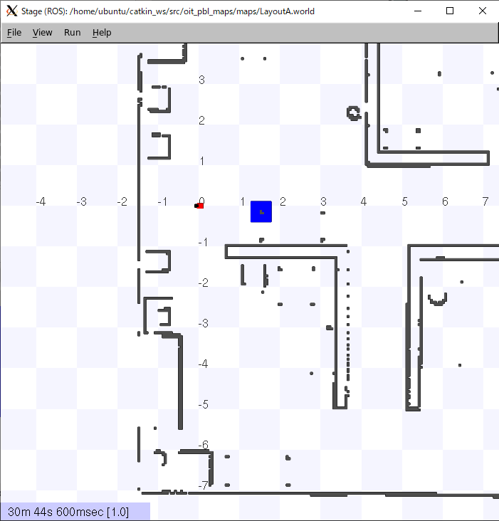
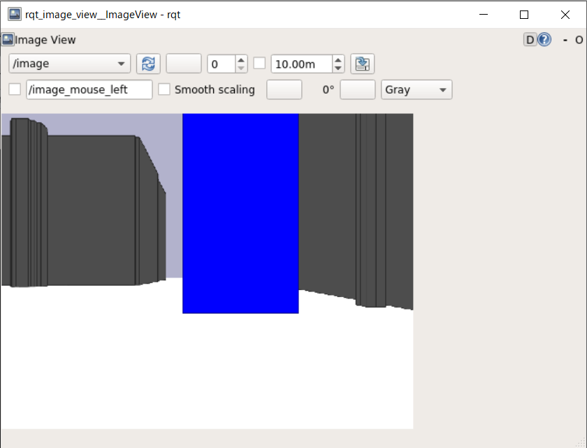
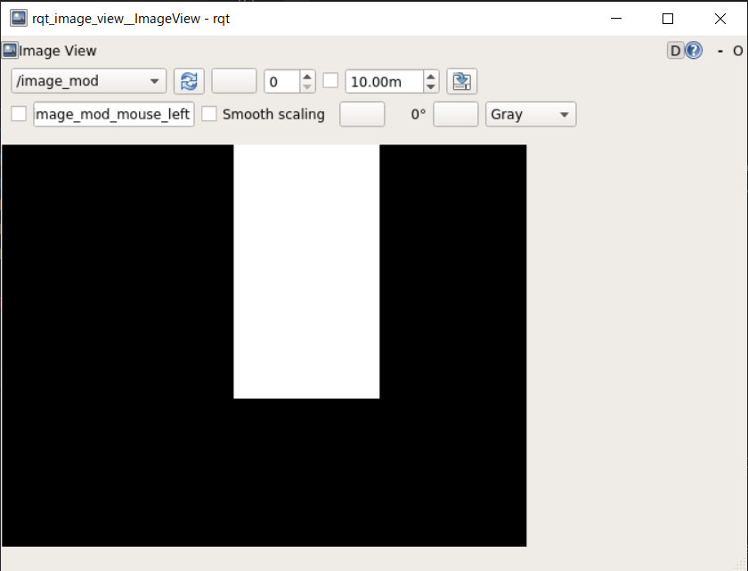

# Sensor data (2)

[README](../README.md)

---

## 仮想カメラのデータを使う

前回の`sensors.py`に追記し、仮想カメラのデータを画像処理する。

## 演習

`sensors.py`にプログラムを追加する。コピー＆ペーストでも構わない。

```python
#!/usr/bin/env python
# -*- coding: utf-8 -*-

import os
import rospy
import tf
from sensor_msgs.msg import LaserScan, Image
from nav_msgs.msg import Odometry

import cv2  # add
from cv_bridge import CvBridge  # add

class Sensors(object):
    def __init__(self):
        self.laser = SensorMessageGetter("/base_scan", LaserScan)
        self.odom = SensorMessageGetter("/odom", Odometry)
        self.img = SensorMessageGetter("/image", Image)
        # add
        self.cv_bridge = CvBridge()
        self.image_pub = rospy.Publisher("/image_mod", Image, queue_size=1)
....

    def process_img(self, msg):
        if msg:
            rospy.loginfo("Recv sensor data. type = %s", type(msg))
            # check reference
            # http://docs.ros.org/en/api/sensor_msgs/html/msg/Image.html
            rospy.loginfo("msg.width = %d, msg.height = %d",
                          msg.width, msg.height)
            # add
            try:
                cv_image = self.cv_bridge.imgmsg_to_cv2(msg, "bgr8")
                hsv = cv2.cvtColor(cv_image, cv2.COLOR_BGR2HSV)
                blue = cv2.inRange(hsv, (100, 200, 200), (140, 255, 255))
                send = self.cv_bridge.cv2_to_imgmsg(blue, "mono8")
                self.image_pub.publish(send)
            except Exception as e:
                rospy.logerr("%s:%s", rospy.get_name(), str(e))
...                
    def process(self):
        rate = rospy.Rate(20)
        tm = rospy.Time.now()
        while (rospy.Time.now().to_sec() - tm.to_sec()) < 100: # change 10 -> 100

```

### 実行順序

まず、シミュレータを起動する。

```shell
$ roslaunch oit_stage_ros navigation.launch
```

ロボットの正面に青いブロックをドラッグする。



しばらくしてから`sensors.py`を実行。

- 受信したセンサデータの情報が出力される。

```shell
$ rosrun oit_pbl_ros_samples sensors.py
[INFO] [1624081858.601793, 16.200000]: /sensors:Started
[INFO] [1624081858.706859, 16.300000]: Recv sensor data. type = <class 'sensor_msgs.msg._LaserScan.LaserScan'>
[INFO] [1624081858.710373, 16.300000]: len(msg.ranges) = 720
[INFO] [1624081858.714078, 16.300000]: msg.ranges[0] = 1.412500
```

さらに別ターミナルで以下のコマンドを実行する。

```shell
$ rqt_image_view
```

画像のビューワーが起動するので、`image`を選択すると、ロボットから見えている画像が表示される。



`image_mod`を選択すると、青色領域の抽出結果が表示される。



## 問題(1)

- 同様に黄色や緑のブロックをロボットの前に置き、色情報を使って領域を抽出しなさい。

---

[README](../README.md)
